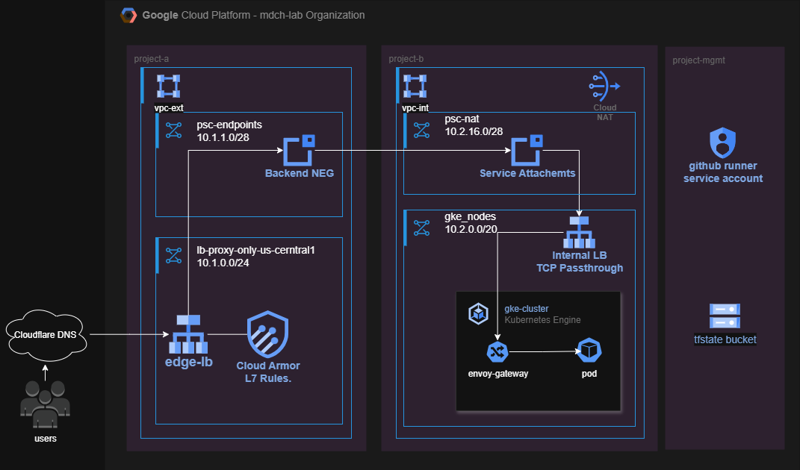

# GCP Terraform Project

Welcome to my GCP Terraform project! This project was developed as part of an assignment during my journey to become a professional DevOps Engineer in the industry.

## Project Overview

This project deploys my home lab dashboard and front page using [Dashy](https://dashy.to/), an open-source application dashboard. The deployment architecture features a GKE cluster in a private project, connected through a Private Service Connect (PSC) connection from an external load balancer to a private load balancer. you can find the application here at [dashy-gcp.mdch-lab.dev](https://dashy-gcp.mdch-lab.dev)

## Architecture

The GCP Terraform project focuses on building relatively complex infrastructure on Google Cloud Platform using Terraform best practices and modern deployment patterns.

### High-Level Design (HLD)

## Key Features & Focus Points

### 1. Terraform Modules Usage
- Leveraged Terraform modules wherever possible to maintain code simplicity and reusability
- Utilized official Google Cloud modules for standardized infrastructure patterns
- Modular approach ensures maintainability and consistency across deployments

### 2. Automated Terraform Workflow
- **GitHub Actions Integration**: Unified CI/CD pipeline for infrastructure management
- **Workload Identity Federation (WIF)**: Secure authentication with Google Cloud from GitHub runners without using JSON keys
- **GitOps Approach**: Infrastructure managed entirely through code commits

### 3. Extended Provider Ecosystem
Beyond the standard Google provider, this project leverages multiple providers to extend Terraform functionality:

- **Flux Provider**: Automatically installs Flux in the GKE cluster and synchronizes manifests from the Git repository
- **Cloudflare Provider**: Updates A records in Cloudflare with the external load balancer's IP address
- **Kubernetes Provider**: Dynamically retrieves the ServiceAttachmentURL from CRDs created in the cluster using Flux

## Technical Challenges & Solutions

### Private Service Connect (PSC) External Load Balancer
**Challenge**: Initial connection issues between backend NEGs and service attachments despite seemingly correct configuration.

**Solution**: 
- Modified external load balancer type from `EXTERNAL` to `EXTERNAL_MANAGED`
- Resolved 400 errors from nginx ingress controller by addressing port configuration conflicts
- Issue was caused by PSC's port-agnostic nature where the internal load balancer selected port 443, conflicting with the external load balancer's port 80 forwarding after TLS termination

## Future Improvements

DevOps and IT projects are continuously evolving, and there's always room for enhancement. Here are planned improvements to enhance security, resiliency, and performance:

### 1. Service Account Security Enhancement
**Current State**: Single main service account with `organizationAdmin` permissions across the entire organization.

**Improvement Plan**: 
- Implement least-privilege principle with granular permissions
- Explore alternative secure methods for project-level permission management
- Maintain security while preserving automation capabilities

### 2. Management Project Automation
**Goal**: Create a dedicated Terraform project for provisioning the management infrastructure, including:
- Main service account provisioning
- OIDC configuration for GitHub WIF
- IAM role attachments and bindings

### 3. Enhanced Cluster Security
**Current Limitation**: GKE control plane has public IP for GitHub runner connectivity.

**Security Enhancement Plan**:
- Disable public access to the control plane entirely
- Implement Identity-Aware Proxy (IAP) connection using a bastion host
- Migrate to self-hosted GitHub runners within the internal VPC
- Achieve complete network isolation while maintaining automation capabilities

### 4. Enhanced Terraform Workflow
**Planned Features**:
- Pull Request integration with `terraform init` and `terraform plan` commands
- Automated failure notifications and reporting
- Enhanced code review process with infrastructure change previews